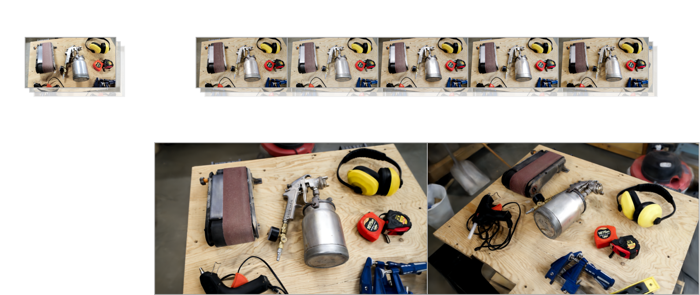

# A Diffusion Approach to Radiance Field Relighting using Multi-Illumination Synthesis
Yohan Poirier-Ginter, Alban Gauthier, Julien Philip, Jean-François, Lalonde, George Drettakis<br>
| [Webpage](https://repo-sam.inria.fr/fungraph/generative-radiance-field-relighting/) | [Paper (96MB)](https://repo-sam.inria.fr/fungraph/generative-radiance-field-relighting/content/paper.pdf) | [Paper (6MB)](https://repo-sam.inria.fr/fungraph/generative-radiance-field-relighting/content/paper.pdf) | [Video](https://www.youtube.com/watch?v=1vR0TsAuH1Q) | [Other GRAPHDECO Publications](http://www-sop.inria.fr/reves/publis/gdindex.php) | [FUNGRAPH project page](https://fungraph.inria.fr) | [Datasets](https://repo-sam.inria.fr/fungraph/generative-radiance-field-relighting/datasets/) | [Viewers for Windows](https://repo-sam.inria.fr/fungraph/generative-radiance-field-relighting/viewer.zip) <br>

<!-- | [Pre-trained Models (14 GB)](https://repo-sam.inria.fr/fungraph/3d-gaussian-splatting/datasets/pretrained/models.zip) | [Evaluation Images (7 GB)](https://repo-sam.inria.fr/fungraph/3d-gaussian-splatting/evaluation/images.zip) | -->

This is the main repository of our work "A Diffusion Approach to Radiance Field Relighting using Multi-Illumination Synthesis". 
**To use our method you will first need to use our single-view relighting network to transform single-illumination captures into generated multi-illumination captures.** [Instructions are available in the secondary repository](). Note that this can only be expected to work well in indoor scenes.

<!-- ### Using the real-time viewer
Alternatively, you can use the real-time viewer to inspect pretrained scenes; [for Windows it can be downloaded directly here](). For Linux you will need to compile it from source, for this refer to the instructions in the [Gaussian Splatting repository]().
[This link contains every pretrained scene shown in the paper](). -->

## Installation
First clone the repo with:
```bash
git clone --recursive https://gitlab.inria.fr/ypoirier/gaussian-splatting-relighting.git
```

Then create the environment. We recommend keeping a separate environment as the one you will use for relighting. This can be be done with:

```bash
conda env create --name gsr python==3.9.7
conda activate gsr
pip install torch==2.4.0 torchvision==0.19.0 torchaudio==2.4.0 --index-url https://download.pytorch.org/whl/cu118
pip install -r requirements.txt
pip install ./submodules/simple-knn
pip install ./submodules/diff-gaussian-rasterization
```
Note that you must install torch with a CUDA version that matches yours --- replace the https://download.pytorch.org/whl/cu118 URL with the correct one for your version (following the instructions on https://pytorch.org/).

On Windows, please use Visual Studio 2019 and not 2022. 

## Training
Launch training with:

```bash
python train.py -s colmap/real/kettle --viewer
```
you can remove the --viewer flag if the interactive viewer isn't needed.

The output files will be saved in `output/kettle/00` by default. 

This require a multi-illumination capture with the following structure:
```bash
colmap/**/$SCENE_NAME/train
   ├── relit_images/  
   ├── sparse/
   └─  ...
```
where `sparse/` is the output from colmap and where `relit_images/` contains images named `0000_dir_00.png, 0000_dir_01.png, ...`.

You can download our captures with:
```bash 
bash download_real_datasets.sh
bash download_real_samples.sh
```
The first command downloads the colmap captures, while the second downloads pre-generated images produced with our ControlNet model and places them in the `relit_images` directory.

## Launch the viewer on a finished training
You can "resume" a finished training to inspect the scene in the viewer, even after the training is complete:
```bash
MODEL=output/kettle/00
python train.py -m $MODEL --resume --viewer
```

You can download our pre-trained scenes with:
```bash 
bash download_pretrained_scenes.sh
```

#### Some tips for best quality
Our method works best in cases where the camera rotation is not too large (e.g. a 360 rotation around an object might not work so well). Large amounts of overlap between images also appears to be beneficial. For instance, the synthetic scenes have a slow camera motion where every camera pose looks at the same point, resulting in good convergence with few floaters. 

On the paintgun scene, we trained using the first 100 images only. This can be done using the `--max_images 100` flag.

## Rendering a video
After training, you can render with:
```bash
MODEL=output/kettle/00 
bash render_relighting_video.sh $MODEL
```

## Synthetic scenes
In the paper, we performed evaluation using synthetic scenes, which made it easier to generate test data. You can download our synthetic training data with:

```bash 
bash download_synthetic_datasets.sh
bash download_synthetic_samples.sh
```

You can then train and render every scene with the following command:
```bash
for SCENE in colmap/synthetic/*; do 
    python train.py --halfres -s $SCENE
    python render.py -m ${SCENE/colmap/output}
done
```

You can also render videos for a few relit direction, as well as light sweep videos with:
```bash
bash render_synthetic_videos.sh
```

We performed evaluation at 768x512; the data for synthetic scenes in 1536x1024 is also available on the website. 

## BibTeX
```
@article{
    10.1111:cgf.15147,
    journal = {Computer Graphics Forum},
    title = {{A Diffusion Approach to Radiance Field Relighting using Multi-Illumination Synthesis}},
    author = {Poirier-Ginter, Yohan and Gauthier, Alban and Philip, Julien and Lalonde, Jean-François and Drettakis, George},
    year = {2024},
    publisher = {The Eurographics Association and John Wiley & Sons Ltd.},
    ISSN = {1467-8659},
    DOI = {10.1111/cgf.15147}
}
```

## Funding and Acknowledgments
This research was funded by the ERC Advanced grant FUNGRAPH No 788065 http://fungraph.inria.fr/, supported by NSERC grant DGPIN 2020-04799 and the Digital Research Alliance Canada. The authors are grateful to Adobe and NVIDIA for generous donations, and the OPAL infrastructure from Université Côte d’Azur. Thanks to Georgios Kopanas and Frédéric Fortier-Chouinard for helpful advice.
